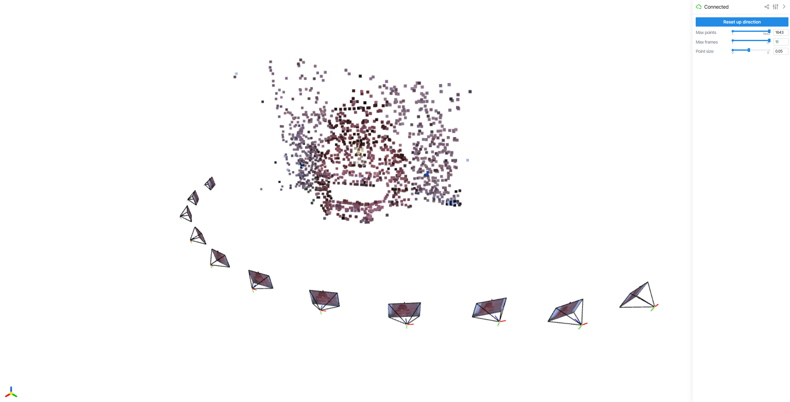
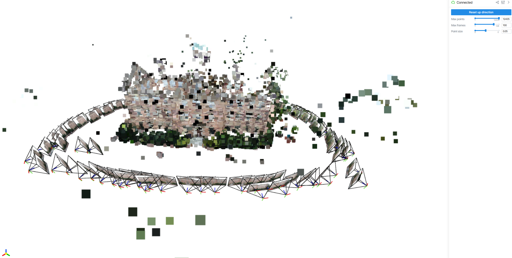

# **Lab 4a: Evaluate Colmap reconstruction with varying Parameters**

We are switching from a Jupyter notebook to a Python file format for this exercise because the code has significant execution time and Jupyter notebooks may experience kernel crashes during long-running processes. For the first half of Lab 4, you will:

- Execute a COLMAP demonstration script using the provided dataset
- Analyze the results by examining error metrics and execution time measurements
- Create your own dataset and run reconstruction

You will create your own dataset by following the established folder structure of the provided example dataset and perform reconstruction on your custom data.


### Installation:

You can either reuse your comp0241 conda environment with the follwoing commands:

```bash
conda install python=3.11

pip install pycolmap
pip install enlighten
pip install viser
pip install pyliblzfse

```

1. **Script Overview:**
   - The `demo_colmap.py` script provides an **example for running incremental Structure from Motion (SfM)** on image datasets using the PyCOLMAP interface. It allows you to choose from several pre-set datasets or use your **own custom dataset** for reconstruction.
   - The key functionality of this script includes **feature extraction** using SIFT, **feature matching**, and **incremental 3D reconstruction**.

2. **File and Folder Structure:**
   - The folder structure below will be used by this script.
     ```
     your_project_folder/
     ├── demo_colmap.py        # Main script to perform the reconstruction
     ├── visualizer.py         # Script for visualizing the reconstruction results             
     │
     ├── example/              # Will be created by the script during reconstruction
     │   ├── fountain/
     │   │   ├── database.db       # Contains image metadata and reconstruction information
     │   │   ├── INFO.log          # Log file with process details
     │   │   └── sfm/              # Directory containing the reconstruction output (SfM model)
     │   ├── south-building/
     │   │   ├── database.db
     │   │   ├── INFO.log
     │   │   └── sfm/
     │   └── "Your own dataset"/
     │       └── images            # Place your own dataset images here for reconstruction
     ```

3. **Script Instructions:**

   1. **Run `demo_colmap.py`:**
      - Open your terminal, navigate to the project folder, and execute the following command to run the script, or your play button on vscode
        ```bash
        python demo_colmap.py
        ```

   2. **Select Dataset:**
      - You will be prompted to select a dataset:
        - Enter `1` to use the **Fountain** dataset (automatically downloaded if not found).
        - Enter `2` to use the **South Building** dataset (automatically downloaded if not found).
        - Enter `3` to use your **own custom dataset**.
      - **Note**: If it's the first time running this script and you choose either **Fountain** or **South Building**, the dataset will be downloaded. This may take a while:
        - **Fountain dataset** is approximately **110 MB**.
        - **South Building dataset** is approximately **430 MB**.

      - If you choose option `3` for the custom dataset, make sure to have your images in a designated folder, and input the path when prompted.

   3. **Adjusting SIFT Extraction Parameters:**
      - The script allows for adjustments to **SIFT feature extraction parameters**, specifically:
        - **Number of Threads (`num_threads`)**: Controls parallel processing speed for SIFT extraction.
          - By **default**, `num_threads` is set to `4`, which is suitable for a **4-core computer**.
          - If your computer has more cores and sufficient memory, you can **increase** the number of threads. However, keep in mind that using more threads will **demand more memory**. Be cautious if you are working with a machine with limited RAM.
        - **Maximum Image Size (`max_image_size`)**: Controls the resolution of images used for reconstruction.
          - By default, **max_image_size** is set to `640`. This setting helps to **reduce the testing time** when processing the Fountain dataset by limiting the image resolution.
          - Increase for larger objects or when more detail is needed
          - Higher values improve accuracy but increase processing time
        - **Maximum Number of Features (`max_num_features`)**: Controls the number of features to detect for each image.
          - The default **max_num_features** is set to `1000` to **speed up the matching process** later. You can increase or decrease this value depending on the complexity of your dataset and the level of detail you require.

      Feel free to open the script and **modify these parameters** to better suit the characteristics of your chosen dataset. For larger objects, increasing the image resolution and the number of detected features will help achieve more detailed reconstructions.

   4. **Incremental Mapping with Progress Bar:**
      - The **`incremental_mapping_with_pbar()`** function shows progress for each image being registered in the reconstruction process.
      - During execution, you will see a **progress bar** that provides feedback on the reconstruction progress.
      - it's just a wrapper for `pycolmap.incremental_mapping()`

4. **Visualizing Reconstruction:**
   - After the reconstruction is complete, the script will automatically **launch the visualization**.
   - The function **`visualize_reconstruction()`** (imported from `visualizer.py`) will help you inspect the resulting 3D model.
   - You will see a link in the terminal generated by the **Viser** library, which will typically be `http://localhost:8080`.
     - **Click on the link** in the terminal or **open a browser** and manually enter `http://localhost:8080` to view the reconstruction results.
   - **Note**: It is important to **save your models** and observe how different parameter adjustments affect the quality of the reconstructed scene.


   

5. **Dataset Customization:**
   - For the lab task, you need to **create your own dataset**:
     - Capture images of a **relatively small object** and a **relatively large object**.
     - **Place these images** in a directory under `"Your own dataset"/images` and use them with `demo_colmap.py`.

6. **Adjusting for Scale:**
   - For **small objects**, try using a smaller `max_image_size` and **increase the number of detected features**.
   - For **larger objects**, consider a higher `max_image_size` for better detail.
   - Experiment and document how these adjustments impact the quality of the reconstruction for different scales.

### **Tasks:**

Note For task 1 and 2, you only need to vary the parameter three times, in addition to the default value we provided. 4 conditions in totoal


Screen capture to show result is enough and please upload your own dataset image without the datasets for option 1 and 2. Your submitted folder should be able to run recosntrcuion of your full dataset when we enter 3 on the terminal.

1. **Vary the Number of Features Extracted:**
   - Adjust the **maximum number of features** (`max_num_features`) parameter during feature extraction and observe the effect on:
     - **Processing Time**: Note how varying the number of features affects the overall runtime.
     - **Mean Reprojection Error**: Analyze how increasing or decreasing the number of extracted features influences the accuracy of the reconstruction by examining the **mean reprojection error** in the terminal and log file (e.g., `INFO.log20241203-010857.19308`).

2. **Vary the Image Resolution** and observe the effect on:
     - **Processing Time**: Note how changing the image resolution affects the overall runtime.
     - **Mean Reprojection Error**: Analyze how adjusting the resolution influences the accuracy of the reconstruction by examining the **mean reprojection error** in the log file. 
     - **Reconstruction Quality**: Perform a qualitative inspection of the reconstruction result. You should aim to improve the fountain reconstruction result compared to the default settings.

3. **Capture Your Own Dataset with the Arducam Camera** (fewer than 30 images) and explain your strategies for capturing:
    1. Why did you choose this location for reconstruction?
    2. Are you trying to capture a side of a building or an object? What procedure did you use to capture the images?
    3. Discard half of your images. Would the reconstruction still work? How would it impact the reconstruction result?

### Submission Requirements
- **Screen Capture**: A screen capture showing the results is sufficient for demonstrating your process.
- **Upload Your Dataset**: Please upload the images captured with your own dataset (for Task 3 only) without including the datasets for Task 1 and Task 2 and any other intermidiante file, such as database.
- **Runnable Folder**: Your submitted folder should be set up so that it can run the reconstruction of your full dataset when we enter `3` on the terminal.


### A few other notes:
1. Colmap has stereo matching and stereo fusion functionality for conducting dense reconstruction, which is not used here as it requires CUDA. If you have CUDA, you can try it yourself.
2. Larger datasets are memory-intensive. Therefore, we limit the number of images you should capture.


##### Expected result from option 1 on deafult parameter:


##### Expected result from option 2 on deafult parameter:

